# 🔐 zkpoor

## Zero Knowledge Proof Of Outstanding Reserves

### *Don't Trust, Verify... Without Doxxing Your Stack* 🚀

<div v-click class="text-6xl animate-pulse mt-8">
  ₿
</div>

<div @click="$slidev.nav.next" class="mt-12 py-1" hover:bg="white op-10">
  Press Space to begin the journey <carbon:arrow-right />
</div>

<div class="abs-br m-6 text-xl">
  <a href="https://github.com/AbdelStark/zkpoor" target="_blank" class="slidev-icon-btn">
    <carbon:logo-github />
  </a>
</div>

<!--
Welcome to zkpoor - the revolutionary solution that finally solves the trust vs transparency dilemma in Bitcoin treasury management
-->

---
transition: slide-up
background: https://images.unsplash.com/photo-1518186285589-2f7649de83e0?auto=format&fit=crop&w=1920&q=80
---

# 📜 The Legend Begins...

<div v-click class="text-xl mt-8">
In the year 2024, while Bitcoin touched the heavens at $100k+...
</div>

<div grid="~ cols-2 gap-8 mt-8">
<div v-click>

**Corporate treasuries:** 
<div class="bg-red-600/20 p-4 rounded-lg">
"We totally have Bitcoin, trust us bro" 🤝
</div>

</div>
<div v-click>

**Bitcoiners:** 
<div class="bg-orange-600/20 p-4 rounded-lg">
"Show us the sats!" 🔍
</div>

</div>
</div>

<div grid="~ cols-2 gap-8 mt-4">
<div v-click>

**Corporate treasuries:** 
<div class="bg-blue-600/20 p-4 rounded-lg">
"Best I can do is a PDF" 📄
</div>

</div>
<div v-click>

**Cypherpunks:** 
<div class="bg-green-600/20 p-4 rounded-lg animate-bounce">
"Hold my private key..." 🔐
</div>

</div>
</div>

<!--
The eternal struggle between corporate transparency and Bitcoin security culture
-->

---
layout: center
background: https://images.unsplash.com/photo-1635070041078-e363dbe005cb?auto=format&fit=crop&w=1920&q=80
---

# 🎭 The Problem: Paper Bitcoin Season

## When "Number Go Up" Meets "Trust Me Bro"

<div v-click class="mt-8 text-lg">

### The Corporate Treasury Dilemma:

</div>

<div grid="~ cols-2 gap-8 mt-6">
<div v-click>

<div class="bg-red-900/30 p-6 rounded-xl border border-red-500">

**Show addresses** 📍

= Become a honeypot 🍯

*"Please hack us!"*

</div>

</div>
<div v-click>

<div class="bg-yellow-900/30 p-6 rounded-xl border border-yellow-500">

**Hide addresses** 🙈

= "Trust me bro" energy 📄

*"Pinky promise we have Bitcoin"*

</div>

</div>
</div>

<div v-click class="mt-8 text-center text-2xl animate-pulse">
🤔 What would Satoshi do?
</div>

<!--
The fundamental dilemma that every Bitcoin treasury faces - security vs transparency
-->

---
layout: center
background: https://images.unsplash.com/photo-1639322537228-f710d846310a?auto=format&fit=crop&w=1920&q=80
---

# ⚡ Enter zkpoor: The Hero We Need

## Cryptographic Proof Without the Dox

<div v-click class="mt-8 text-xl">

**zkpoor** lets companies prove their diamond hands WITHOUT revealing:

</div>

<div class="grid grid-cols-2 gap-8 mt-8">

<div v-click class="space-y-4">

<div class="bg-red-900/20 p-4 rounded-lg border border-red-400 line-through">
❌ Bitcoin addresses
</div>

<div class="bg-red-900/20 p-4 rounded-lg border border-red-400 line-through">
❌ UTXO details  
</div>

</div>

<div v-click class="space-y-4">

<div class="bg-red-900/20 p-4 rounded-lg border border-red-400 line-through">
❌ Transaction history
</div>

<div class="bg-green-900/20 p-4 rounded-lg border border-green-400 animate-pulse">
✅ Just pure, verifiable **TRUTH**
</div>

</div>

</div>

<div v-click class="mt-8 text-center text-lg italic">
*Because real Bitcoiners don't trust, they verify* 🔍
</div>

---
layout: center
background: https://images.unsplash.com/photo-1518186285589-2f7649de83e0?auto=format&fit=crop&w=1920&q=80
---

# 🛠️ How It Works: STARK Technology

## The Magic of Zero Knowledge

<div v-click class="mt-8">

```text
Treasury Manager: "Here's my UTXO list"
         ↓
    [STARK PROOF GENERATION]
         ↓
Public: "I can verify you have X BTC"
        "But I know nothing else!"
```

</div>

<div v-click class="mt-8">

### The Beauty:

<div class="grid grid-cols-3 gap-4 mt-4">

<div class="bg-blue-900/20 p-4 rounded-lg border border-blue-400">
**Generate proof:** 
Private UTXOs → STARK circuit → Public proof
</div>

<div class="bg-green-900/20 p-4 rounded-lg border border-green-400">
**Verify anywhere:** 
In-browser, trustless, instant
</div>

<div class="bg-purple-900/20 p-4 rounded-lg border border-purple-400">
**Result:** 
Mathematical certainty without information leakage
</div>

</div>

</div>

<div v-click class="mt-8 text-center text-lg italic">
*It's like showing your poker hand won without revealing the cards* 🃏
</div>

<!--
STARK proofs provide mathematical certainty while preserving privacy
-->

---
layout: two-cols
background: https://images.unsplash.com/photo-1551288049-bebda4e38f71?auto=format&fit=crop&w=1920&q=80
---

# 🎮 The zkpoor Experience

## For Treasury Managers (The HODLers)

<div v-click>

### Before zkpoor:
1. Claim holdings in earnings call 📞
2. Get called paper Bitcoin 📄
3. Cope and seethe 😤

</div>

<div v-click class="mt-6">

### With zkpoor:
1. Input your UTXOs privately 🔐
2. Generate cryptographic proof ⚡
3. Share proof, maintain opsec 🛡️
4. **Gigachad energy achieved** ✨

</div>

::right::

<div v-click class="mt-8">

## 🔍 For The Verifiers (The People)

### Trust Nothing, Verify Everything

**One Click Verification:**
- Visit enhanced Bitcoin Treasury site
- Click "Verify with STARK" 
- Watch the magic happen in your browser 🎭
- Green checkmark = Mathematical proof ✅
- No nodes, no CLI, just truth

</div>

<div v-click class="mt-8 text-center text-lg italic bg-green-900/20 p-4 rounded-lg">
*"Don't trust, verify" has never been this easy*
</div>

<!--
The user experience is designed to be magical for both sides of the equation
-->

---
layout: center
background: https://images.unsplash.com/photo-1640340434855-6084b1f4901c?auto=format&fit=crop&w=1920&q=80
---

# 💊 The Red Pill: Why This Matters

## We're Solving Real Problems

<div class="grid grid-cols-3 gap-6 mt-8">

<div v-click>

### For Companies 🏢

<div class="bg-blue-900/20 p-4 rounded-lg space-y-2">
- Prove reserves without becoming a target
- End the "paper Bitcoin" FUD
- Maintain fiduciary responsibility AND transparency
</div>

</div>

<div v-click>

### For Bitcoin ₿

<div class="bg-orange-900/20 p-4 rounded-lg space-y-2">
- Reduce systemic risk from unverifiable claims
- Strengthen "Don't trust, verify" culture
- Make cryptographic proof the standard, not the exception
</div>

</div>

<div v-click>

### For You 🫵

<div class="bg-green-900/20 p-4 rounded-lg space-y-2">
- Know which companies are real HODLers
- Verify claims in seconds, not never
- Sleep better knowing the sats are real
</div>

</div>

</div>

<!--
This isn't just tech for tech's sake - we're solving fundamental trust issues in the Bitcoin ecosystem
-->

---
layout: center
background: https://images.unsplash.com/photo-1639762681485-074b7f938ba0?auto=format&fit=crop&w=1920&q=80
---

# Imagine a world where...

<div v-click class="mt-8 space-y-6 text-lg">

<div class="bg-purple-900/20 p-6 rounded-xl border border-purple-400">
✨ Every corporate treasury can prove reserves without risk
</div>

<div class="bg-blue-900/20 p-6 rounded-xl border border-blue-400">
🔄 "Trust me bro" becomes "Verify my proof"
</div>

<div class="bg-red-900/20 p-6 rounded-xl border border-red-400">
🦴 Paper Bitcoin becomes extinct
</div>

<div class="bg-green-900/20 p-6 rounded-xl border border-green-400 animate-pulse">
💪 Saylor can flex his stack cryptographically
</div>

</div>

<div v-click class="mt-12 text-center text-2xl font-bold">
**zkpoor: Because transparency shouldn't require doxxing** 🔐
</div>

---
layout: center
background: https://images.unsplash.com/photo-1551288049-bebda4e38f71?auto=format&fit=crop&w=1920&q=80
---

# 🎯 Our Hackathon Demo

## See It In Action

<div class="grid grid-cols-3 gap-6 mt-8">

<div v-click>

### 1. Public Dashboard 📊

<div class="bg-blue-900/20 p-4 rounded-lg space-y-2 text-sm">
- Classic Bitcoin Treasury view
- NEW: "Verify Proof" buttons everywhere
- Real-time verification animations
- Green checkmarks of truth ✅
</div>

</div>

<div v-click>

### 2. Treasury Manager Portal 👨‍💼

<div class="bg-green-900/20 p-4 rounded-lg space-y-2 text-sm">
- Clean UTXO input interface
- One-click proof generation
- Download your proof
- Share with the world
</div>

</div>

<div v-click>

### 3. The Magic Moment ✨

<div class="bg-purple-900/20 p-4 rounded-lg space-y-2 text-sm">
- Generate proof as treasury manager
- Switch to public view
- Verify in-browser
- Watch the FUD evaporate 🚀
</div>

</div>

</div>

<div v-click class="mt-8 text-center text-lg animate-pulse">
🎭 **Ready for the live demo?**
</div>

---
layout: center
background: https://images.unsplash.com/photo-1639762681485-074b7f938ba0?auto=format&fit=crop&w=1920&q=80
---

# 🏗️ Technical Architecture

```mermaid {scale: 0.8}
flowchart TD
    TM[Treasury Manager Portal] --> PG[Proof Generator]
    PG --> PP[Public Proof]
    PP --> PD[Public Dashboard]
    PD --> BV[Browser Verifier]
    BV --> VR[Verification Result ✅]
    
    style TM fill:#1f2937
    style BV fill:#7c2d12
    style VR fill:#166534
```

<div class="mt-8">



</div>


---
layout: center
background: https://images.unsplash.com/photo-1518186285589-2f7649de83e0?auto=format&fit=crop&w=1920&q=80
---

# 🎪 Live Demo Time!

<div class="text-center mt-12">

<div v-click class="text-8xl animate-bounce mb-8">
🎭
</div>

<div v-click class="text-3xl mb-8">
**Let's see zkpoor in action!**
</div>

<div v-click class="space-y-4">

<div class="bg-blue-900/20 p-6 rounded-xl border border-blue-400">
👨‍💼 **Treasury Manager:** Generate proof with mock UTXOs
</div>

<div class="bg-green-900/20 p-6 rounded-xl border border-green-400">
👀 **Public Viewer:** Verify the proof instantly
</div>

<div class="bg-purple-900/20 p-6 rounded-xl border border-purple-400">
✨ **Magic Moment:** Watch mathematical certainty unfold
</div>

</div>

</div>

---
layout: end
background: https://images.unsplash.com/photo-1640340434855-6084b1f4901c?auto=format&fit=crop&w=1920&q=80
---

# 🌟 Thank You!

<div class="text-center mt-8">

<div class="text-6xl mb-8">🔐</div>

<div class="text-4xl mb-6">**zkpoor**</div>

<div class="text-xl mb-8 italic">
*Zero Knowledge Proof Of Outstanding Reserves*
</div>

<div class="grid grid-cols-2 gap-8 mt-8 text-lg">

<div>

### 🚀 What We Built:
- UI/UX with Bitcoin Treasury fork
- Cairo program for the verification of unspent UTXOs (without ownership proof)
- Rust backend with async proof generation
- In-browser STARK verification (almost)

</div>

<div>

### 🎯 Impact:
- Solve trust vs transparency dilemma
- Enable cryptographic proof of reserves
- Strengthen Bitcoin's verification culture
- End the "paper Bitcoin" era

</div>

</div>

<div class="mt-8">

**GitHub:** [github.com/AbdelStark/zkpoor](https://github.com/AbdelStark/zkpoor)

</div>

<div class="mt-6 text-lg italic">
*Don't Trust, Verify... Without Doxxing Your Stack* ✨
</div>

</div>

